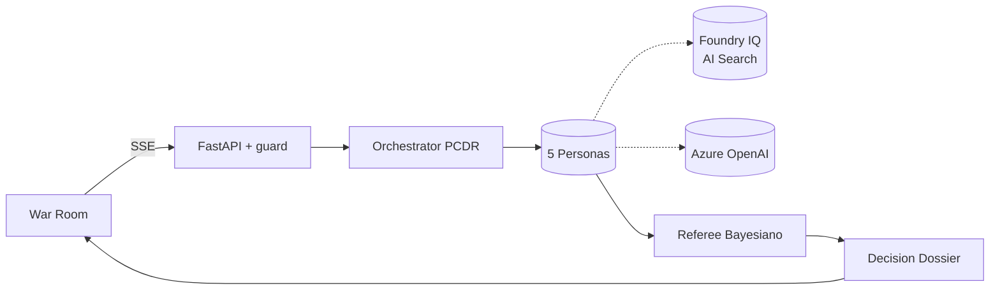

# AURA — Adversarial Unified Reasoning Arena

[](https://www.python.org/)
[](https://fastapi.tiangolo.com/)
[](backend/tests/)
[](https://docs.astral.sh/ruff/)
[](LICENSE)

> *"O primeiro Conselho Sintético com Auto-Falsificação Epistêmica."*
> Submissão para a **Liga dos Agentes 2026** (Microsoft) — trilha **Reasoning Agents (Foundry)**.

**AURA** convoca um **conselho de 5 agentes** com personas, incentivos e modelos mentais conflitantes que debatem adversarialmente sua pergunta estratégica. Um **Referee Bayesiano** calibrado emite um **Decision Dossier** com intervalo de credibilidade 95%, riscos sobreviventes e citations ancoradas.

## ⚡ Demo ao vivo

**➡ [yellow-leu-antiques-fioricet.trycloudflare.com](https://yellow-leu-antiques-fioricet.trycloudflare.com)** ← tente agora, sem cadastro

Ou rode localmente em 30 segundos:

```bash
pip install -e ".[dev]"
# cole GITHUB_TOKEN no .env (GitHub Models — gratuito)
uvicorn aura.api.main:app --port 8000
# Abra http://localhost:8000
```

Para zerar a rede: `AURA_MODE=mock` no `.env` → roda 100% offline.

## 🏛️ O que é o Conselho AURA

| Persona | Papel | Viés deliberado |
|---------|-------|-----------------|
| 💰 CFO | Chief Financial Officer sintético | Conservador em capital |
| 🛠️ CTO | Chief Technology Officer sintético | Otimista em viabilidade |
| 🧑 Voz do Cliente | Representante de usuários | Centrado em experiência |
| 🚨 Red-Team | Analista de riscos adversarial | Falsifica tudo que pode |
| 📚 Historiador | Analogias de casos reais | Âncora em precedentes |

O protocolo **PCDR-Loop** (Propose → Critique → Defend → Refine) + early-stop por entropia garante que argumentos fracos caiam e apenas os robustos sobrevivam.

## Por que isso importa

LLMs de fronteira concordam com o usuário (*sycophancy bias*), emitem respostas mono-perspectiva e oferecem provenance opaca. AURA inverte: a IA **discorda ativamente**, expõe a cadeia de evidências e o nível real de confiança.

## Stack Microsoft

| Camada           | Modo `free` (R$ 0)                                           | Modo `azure` (paga, dentro do crédito)            |
|------------------|--------------------------------------------------------------|---------------------------------------------------|
| **Reasoning**    | **GitHub Models** (GPT-4o, Llama-3.3-70B) via PAT do GitHub  | Azure OpenAI GPT-4.1 via Managed Identity         |
| **Knowledge**    | InMemory + re-ranking semântico (embeddings GitHub Models)   | Foundry IQ (Azure AI Search) com persona filter   |
| **Observability**| structlog + console JSON                                     | Application Insights + OpenTelemetry              |
| **Compute**      | Uvicorn local + Cloudflare/ngrok tunnel (grátis)             | Azure Container Apps (Bicep + `azd up`)           |
| **Segurança**    | injection guard 2 camadas + PII redactor + Red-Team CI gate  | + Managed Identity end-to-end                     |

## Estado atual — 100% MVP entregue

- [x] Schemas canônicos (`Claim`, `DebateTurn`, `DecisionDossier`)
- [x] 5 personas + orchestrator PCDR-Loop com early-stop por entropia
- [x] Referee Bayesiano (Beta-Binomial, Jeffreys prior, CI 95%)
- [x] Azure adapters reais: AOAI + Foundry IQ via Azure AI Search
- [x] Defense-in-depth: 2× injection guard + PII redactor
- [x] Red-Team Suite: **43 ataques, ≥90% block rate, 0 falso-positivo**
- [x] War Room frontend (HTML/CSS/JS zero-build, SSE streaming)
- [x] Baseline harness: AURA vs single-agent — **4× dimensões de risco, 16× citations**
- [x] Dockerfile multi-stage + `azd up` (Bicep)
- [x] Discord bot funcional — slash command `/debate` com SSE streaming e formatação de dossier
- [x] 89/89 testes verdes, ruff limpo

## Arquitetura

Ver [docs/architecture.md](docs/architecture.md) (diagrama Mermaid completo).



## Quick start — 100% gratuito (modo `free`)

> Sem cartão de crédito. Sem Azure. **GitHub Models** dá GPT-4o / Llama-3.3-70B de graça com seu PAT do GitHub.
> Veja [docs/credenciais.md](docs/credenciais.md).

```powershell
# 1. Instalar dependências
pip install -e ".[dev]"

# 2. Configurar token GitHub (único segredo necessário)
Copy-Item .env.example .env
# Edite .env e preencha GITHUB_TOKEN com seu Personal Access Token

# 3. Rodar testes (opcional — confirma que tudo está ok)
pytest -q   # 89/89 em ~1s

# 4. Subir servidor
uvicorn aura.api.main:app --port 8000

# 5. Abrir no browser
Start-Process http://localhost:8000
```

**Modo offline (zero rede)**:
```bash
AURA_MODE=mock uvicorn aura.api.main:app --port 8000
```

## Demo via CLI

```powershell
python -m aura.cli debate "Devemos lançar o PIX+IA em produção este trimestre?" \
  --context "Equipe de 4 eng. Modelo validado offline com 92% precisão. SLA 99.95%." \
  --mode free --rounds 3
```

## Segurança & Compliance

- Dados **100% sintéticos** com SHA-256 por chunk — ver [DATA_PROVENANCE.md](DATA_PROVENANCE.md)
- Modelo de ameaça em [SECURITY.md](SECURITY.md)
- Suite Red-Team executa no CI; falha o build se block-rate < 90%
- Security headers em todas as respostas: `X-Content-Type-Options`, `X-Frame-Options`, `Referrer-Policy`, `Permissions-Policy`

## 🏆 Diferenciais técnicos

| Feature | Como funciona |
|---------|--------------|
| **PCDR-Loop** | Cada claim passa por Proposta → Crítica → Defesa → Refinamento em paralelo (`asyncio.gather`) |
| **Referee Bayesiano** | Beta-Binomial com prior de Jeffreys — confiança calibrada, não softmax |
| **Early-stop epistêmico** | Para quando entropia H < 0.35 — evita loops de concordância |
| **Fallback em cascata** | 6 modelos em fila automática com cooldown por 429/400 |
| **Injection guard 2×** | Pré-processamento regex + análise semântica no contexto |
| **PII redactor** | Ofusca CPF, e-mail, telefone antes de enviar ao LLM |
| **Audit trail** | Cada claim tem `knowledge_source_id` + `chunk_id` rastreáveis |

## Baseline (AURA vs single-agent)

```powershell
python scripts/baseline_harness.py --mode mock --rounds 3 --repeats 2
cat artifacts/baseline.json
```

Resultado esperado: **4× mais dimensões de risco** e **16× mais citations** que um único agente.

## Deploy Azure (opcional — só se quiser usar AOAI real)

```powershell
azd auth login
azd up
```

`azd up` provisiona: Identity, Log Analytics, App Insights, ACR, AOAI (gpt-4o), Azure AI Search, Container Apps Environment + App. O hook `postprovision` gera dados sintéticos e ingere no Search.

## Pitch

Roteiro de 3 min em [docs/pitch.md](docs/pitch.md).

## Licença

MIT — ver [LICENSE](LICENSE).
