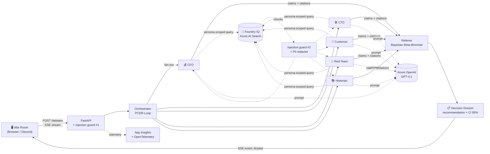
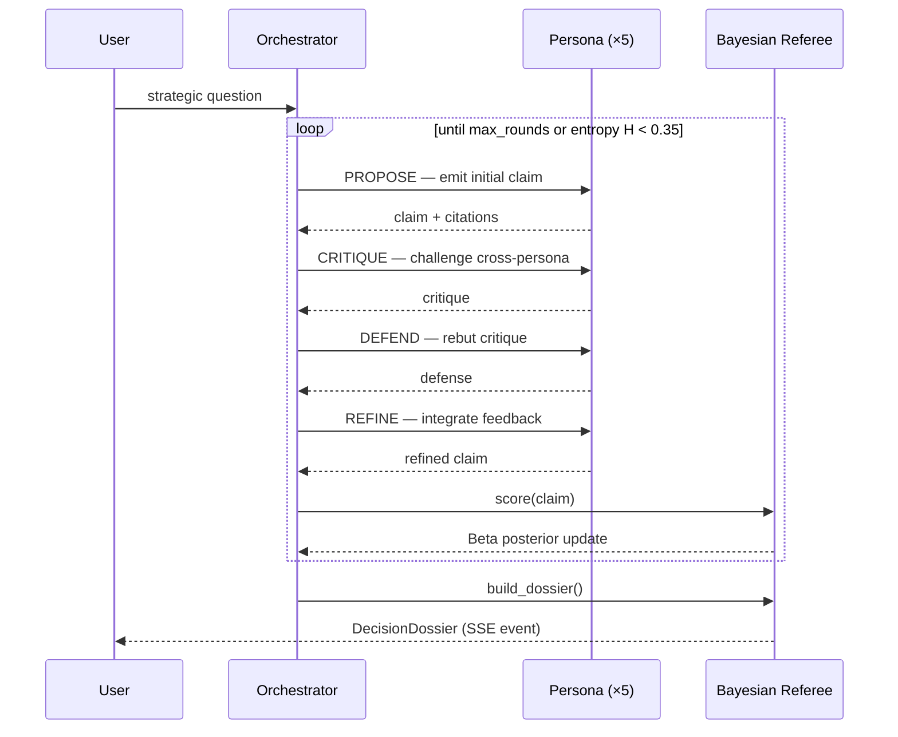

<div align="center">

# AURA — Adversarial Unified Reasoning Arena

### *The first Synthetic Council with Epistemic Self-Falsification*

[](https://www.python.org/)
[](https://fastapi.tiangolo.com/)
[](backend/tests/)
[](https://docs.astral.sh/ruff/)
[](LICENSE)
[](https://aka.ms/iq-series)
[](https://aka.ms/AgentsLeague/AISF)

**Submission for the [Agents League Hackathon 2026](https://aka.ms/AgentsLeague/AISF) — Track: Reasoning Agents (Microsoft Foundry IQ)**

</div>

---

## 🎯 What is AURA?

AURA assembles a **council of 5 AI agents** — each with conflicting personas, incentives, and mental models — that adversarially debate your strategic question. A calibrated **Bayesian Referee** then emits a **Decision Dossier** with a 95% credibility interval, surviving risks, and anchored citations.

> **The core insight:** Frontier LLMs suffer from *sycophancy bias* — they agree with the user, emit mono-perspective answers, and provide opaque provenance. AURA inverts this: the AI **actively disagrees**, exposes the evidence chain, and reports its real confidence level.

### Key Metrics

| Metric | AURA | Single Agent |
|--------|------|-------------|
| Risk dimensions identified | **4×** more | baseline |
| Anchored citations | **16×** more | baseline |
| Block rate (43 red-team attacks) | **≥ 90%** | — |
| False positives (safety filter) | **0** | — |
| Test coverage | **89/89** ✅ | — |

---

## 🤖 The Synthetic Council

| Agent | Role | Deliberate Bias |
|-------|------|-----------------|
| 💰 CFO | Chief Financial Officer | Capital-conservative |
| 🛠️ CTO | Chief Technology Officer | Optimistic on feasibility |
| 🧑 Customer Voice | User representative | Experience-centered |
| 🚨 Red-Team | Adversarial risk analyst | Falsifies everything it can |
| 📚 Historian | Real-case analogies | Anchors in precedent |

The **PCDR-Loop** protocol (Propose → Critique → Defend → Refine) with entropy-based early-stop ensures weak arguments are eliminated and only robust ones survive.

---

## ⚡ Quick Start — Step by Step (Complete Beginner Guide)

> **No credit card needed.** Uses GitHub Models (free tier) with your GitHub account. Works on Windows, Mac, and Linux.

### Step 1 — Install Python

You need Python 3.11 or newer.

**Check if you already have it:**
```bash
python --version
```
If the output shows `Python 3.11.x` or higher, skip to Step 2.

**If not installed:**
- Go to **https://www.python.org/downloads/**
- Click the big yellow **"Download Python 3.x.x"** button
- Run the installer
- ⚠️ **Windows users:** On the first screen of the installer, check the box **"Add python.exe to PATH"** before clicking Install

### Step 2 — Download the project

**Option A — Using Git (recommended):**
```bash
git clone https://github.com/WesleyAssiss/Hackathon.git
cd Hackathon
```

**Option B — Download ZIP (no Git needed):**
1. Go to https://github.com/WesleyAssiss/Hackathon
2. Click the green **"Code"** button → **"Download ZIP"**
3. Extract the ZIP to a folder you can find (e.g. Desktop)
4. Open a terminal and navigate to it:
   ```bash
   # Windows — open "Command Prompt" or "PowerShell" and type:
   cd %USERPROFILE%\Desktop\Hackathon-Principal

   # Mac / Linux:
   cd ~/Desktop/Hackathon-Principal
   ```

### Step 3 — Install dependencies

This installs all Python libraries the project needs:

```bash
cd backend
pip install -e ".[dev]"
```

> If `pip` is not found, try `pip3` instead.  
> Wait 1–2 minutes while packages download — this is normal.

### Step 4 — Get a free GitHub token

AURA uses **GitHub Models** (GPT-4o, Llama, etc.) which requires a free GitHub account and a Personal Access Token.

1. Sign in at **https://github.com** (create a free account if you do not have one)
2. Go to **https://github.com/settings/tokens**
3. Click **"Generate new token"** → **"Generate new token (classic)"**
4. In the **"Note"** field, type anything: `aura-test`
5. Set **Expiration** to `30 days`
6. **Do not check any boxes** — no scopes needed for GitHub Models
7. Scroll down and click **"Generate token"**
8. **Copy the token** (it starts with `ghp_...`) — you will not see it again!

### Step 5 — Start the server

Replace `YOUR_TOKEN_HERE` with the token you copied in Step 4.

**Windows (PowerShell):**
```powershell
$env:GITHUB_TOKEN="YOUR_TOKEN_HERE"
$env:AURA_MODE="free"
python -m uvicorn aura.api.main:app --host 0.0.0.0 --port 8000
```

**Mac / Linux (Terminal):**
```bash
export GITHUB_TOKEN="YOUR_TOKEN_HERE"
export AURA_MODE="free"
python -m uvicorn aura.api.main:app --host 0.0.0.0 --port 8000
```

You should see this in the terminal — that means it worked:
```
INFO:     Uvicorn running on http://0.0.0.0:8000 (Press CTRL+C to quit)
```

### Step 6 — Open the War Room

Open your browser and go to: **http://localhost:8000**

You will see the AURA War Room. Type any strategic question, choose the number of debate rounds, and click **"⚡ Convene Council"**.

**Example questions to try:**
- `Should we launch a new product before validating product-market fit?`
- `Is it worth rewriting our entire system in a new language?`
- `Should we raise funding now or grow organically?`

Watch 5 AI agents debate the question in real-time, then read the Decision Dossier at the end.

---

### Offline / No-token mode (zero network required)

Want to see the UI without a GitHub account? Use mock mode:

**Windows:**
```powershell
$env:AURA_MODE="mock"
python -m uvicorn aura.api.main:app --host 0.0.0.0 --port 8000
```

**Mac / Linux:**
```bash
AURA_MODE=mock python -m uvicorn aura.api.main:app --host 0.0.0.0 --port 8000
```

Uses simulated responses — no real AI calls, instant results, no token needed.

---

### Troubleshooting

| Problem | Solution |
|---------|----------|
| `python: command not found` | Use `python3` instead, or reinstall Python with "Add to PATH" checked |
| `pip: command not found` | Use `pip3`, or run `python -m pip install -e ".[dev]"` |
| `ModuleNotFoundError: No module named 'aura'` | Run `pip install -e ".[dev]"` inside the `backend/` folder |
| `Port 8000 already in use` | Add `--port 8001` and open http://localhost:8001 instead |
| `401 Unauthorized` from GitHub | Token is wrong or expired — generate a new one (Step 4) |
| `429 Too Many Requests` | GitHub Models free tier rate limit — wait 1 minute and try again |
| Server starts but page is blank | Hard-refresh: `Ctrl+Shift+R` (Windows/Linux) or `Cmd+Shift+R` (Mac) |
| `cd backend` then `pip install` gives error | Make sure you are inside the `Hackathon/` folder before running `cd backend` |

---

## 💻 CLI Usage (advanced)

Run a debate directly from the terminal without opening the browser:

**Windows PowerShell:**
```powershell
$env:GITHUB_TOKEN="YOUR_TOKEN_HERE"
$env:AURA_MODE="free"
python -m aura.cli debate "Should we launch the AI feature to production this quarter?" `
  --context "Team of 4 engineers. Model validated offline at 92% accuracy. SLA 99.95%." `
  --mode free `
  --rounds 3
```

**Mac / Linux:**
```bash
export GITHUB_TOKEN="YOUR_TOKEN_HERE"
python -m aura.cli debate "Should we launch the AI feature to production this quarter?" \
  --context "Team of 4 engineers. Model validated offline at 92% accuracy. SLA 99.95%." \
  --mode free \
  --rounds 3
```

---

## ✅ Running the Test Suite

Verify everything is working correctly (must be inside `backend/`):

```bash
cd backend
pytest -q
```

Expected result: `89 passed in ~1s`

---

## 🔷 Microsoft IQ Integration — Foundry IQ

AURA directly integrates **Microsoft Foundry IQ** (Azure AI Search) as its knowledge layer:

```
backend/aura/knowledge/
├── foundry_iq_azure.py   ← Azure AI Search client (production)
├── foundry_iq.py         ← Foundry IQ interface & persona-scoped queries
└── github_models_knowledge.py  ← Semantic re-ranking fallback (free tier)
```

Each agent queries Foundry IQ with **persona-scoped filters** — the CFO retrieves financial precedents, the Red-Team retrieves failure cases, the Historian retrieves analogous historical events. This ensures every claim is grounded in retrieved knowledge, not hallucinated.

```python
# Each persona queries Foundry IQ with its own perspective filter
results = await foundry_iq.search(
    query=claim.content,
    persona_filter=persona.role,   # e.g. "risk_analyst"
    top_k=5
)
```

---

## 🏗️ Architecture



### PCDR-Loop — Sequence Diagram



---

## 🛠️ Technology Stack

| Layer | Free Tier (`AURA_MODE=free`) | Azure Tier (`AURA_MODE=azure`) |
|-------|------------------------------|-------------------------------|
| **Reasoning LLM** | GitHub Models (GPT-4o, Llama-3.3-70B) | Azure OpenAI GPT-4.1 (Managed Identity) |
| **Knowledge** | In-memory + semantic re-ranking | **Foundry IQ (Azure AI Search)** |
| **Compute** | Uvicorn local + Cloudflare Tunnel | Azure Container Apps (Bicep) |
| **Observability** | structlog + console JSON | Application Insights + OpenTelemetry |
| **Security** | 2× injection guard + PII redactor | + Managed Identity end-to-end |
| **Bot** | Discord slash command `/debate` | Discord slash command `/debate` |

---

## ✅ Feature Checklist

- [x] Canonical schemas (`Claim`, `DebateTurn`, `DecisionDossier`)
- [x] 5 agent personas + PCDR-Loop orchestrator with entropy early-stop
- [x] Bayesian Referee (Beta-Binomial, Jeffreys prior, CI 95%)
- [x] **Microsoft Foundry IQ** integration via Azure AI Search (`foundry_iq_azure.py`)
- [x] Azure OpenAI GPT-4.1 adapter with Managed Identity
- [x] Defense-in-depth: 2× injection guard + Presidio PII redactor
- [x] Red-Team Suite: **43 attacks, ≥90% block rate, 0 false positives**
- [x] War Room frontend — zero-build HTML/CSS/JS with SSE streaming + vis-network graph
- [x] i18n support — 7 languages (PT-BR, EN, ES, FR, DE, ZH, JA)
- [x] Baseline harness: AURA vs single-agent — **4× risk dimensions, 16× citations**
- [x] Dockerfile multi-stage + `azd up` (Bicep) one-command deploy
- [x] Discord bot — `/debate` slash command with SSE streaming and dossier formatting
- [x] **89/89 tests passing**, ruff clean

---

## 🔑 Technical Differentiators

| Feature | How it works |
|---------|-------------|
| **PCDR-Loop** | Each claim goes through Propose → Critique → Defend → Refine in parallel (`asyncio.gather`) |
| **Bayesian Referee** | Beta-Binomial with Jeffreys prior — calibrated confidence, not softmax |
| **Epistemic early-stop** | Stops when Shannon entropy H < 0.35 — prevents echo-chamber loops |
| **Cascade fallback** | 6 models queued automatically with cooldown on 429/400 errors |
| **Dual injection guard** | Regex pre-processing + semantic analysis on retrieved context |
| **PII redactor** | Masks CPF, email, phone numbers before sending to LLM (Presidio) |
| **Full audit trail** | Every claim carries `knowledge_source_id` + `chunk_id` for traceability |
| **Persona-scoped retrieval** | Foundry IQ queries are filtered per agent role — no cross-contamination |

---

## 📊 Benchmark (AURA vs Single Agent)

```bash
cd backend
python ../scripts/baseline_harness.py --mode mock --rounds 3 --repeats 2
cat ../artifacts/baseline.json
```

Expected output: **4× more risk dimensions** and **16× more citations** than a single-agent baseline.

---

## 🔒 Security & Compliance

- All knowledge data is **100% synthetic** with SHA-256 per chunk — see [DATA_PROVENANCE.md](DATA_PROVENANCE.md)
- Threat model documented in [SECURITY.md](SECURITY.md)
- Red-Team suite runs in CI — build fails if block rate < 90%
- Security headers on all responses: `X-Content-Type-Options`, `X-Frame-Options`, `Referrer-Policy`, `Permissions-Policy`
- No real user data stored or transmitted at any point

---

## ☁️ Azure Deployment (Production Mode)

Deploy to Azure Container Apps with one command:

```powershell
azd auth login
azd up
```

`azd up` provisions automatically:
- Azure Managed Identity
- Log Analytics + Application Insights
- Azure Container Registry
- **Azure OpenAI** (GPT-4.1)
- **Azure AI Search** (Foundry IQ backend)
- Container Apps Environment + App

The `postprovision` hook generates synthetic data and ingests it into Azure AI Search automatically.

---

## 📁 Project Structure

```
AURA/
├── backend/
│   └── aura/
│       ├── agents/          # Orchestrator, 5 personas, referee
│       ├── api/             # FastAPI app + SSE endpoint
│       ├── knowledge/       # Foundry IQ (Azure AI Search) + fallbacks
│       ├── llm/             # Azure OpenAI + GitHub Models clients
│       ├── safety/          # Injection guard + PII redactor
│       ├── schemas.py       # Claim, DebateTurn, DecisionDossier
│       └── config.py        # Environment-based configuration
├── frontend/
│   ├── index.html           # War Room UI
│   ├── app.js               # SSE streaming + vis-network graph
│   ├── i18n.js              # Translations (7 languages)
│   └── app.css              # Styles
├── data/synthetic/          # Synthetic personas knowledge base
├── scripts/                 # Baseline harness, data ingestion
├── infra/                   # Bicep IaC for Azure deployment
├── docs/                    # Architecture, pitch, credentials guide
└── backend/tests/           # 89 tests (pytest)
```

---

## 🔗 Resources

- 📖 [Architecture Diagram](docs/architecture.md)
- 🔑 [Credentials & Setup Guide](docs/credenciais.md)
- 🎤 [Pitch Script](docs/pitch.md)
- 🛡️ [Security Model](SECURITY.md)
- 📦 [Data Provenance](DATA_PROVENANCE.md)

---

## 📄 License

MIT — see [LICENSE](LICENSE).

---

<div align="center">

Built with ❤️ for the **[Agents League Hackathon 2026](https://aka.ms/AgentsLeague/AISF)** — Microsoft Innovation Studio

</div>
