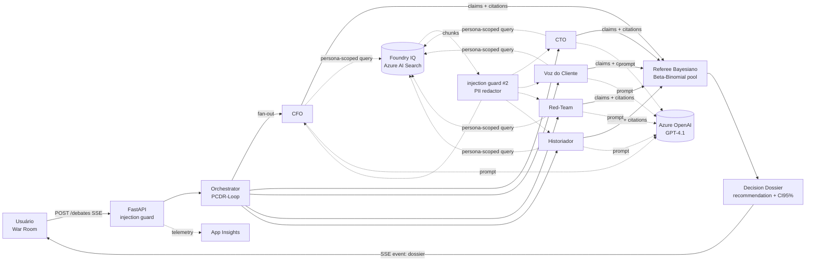
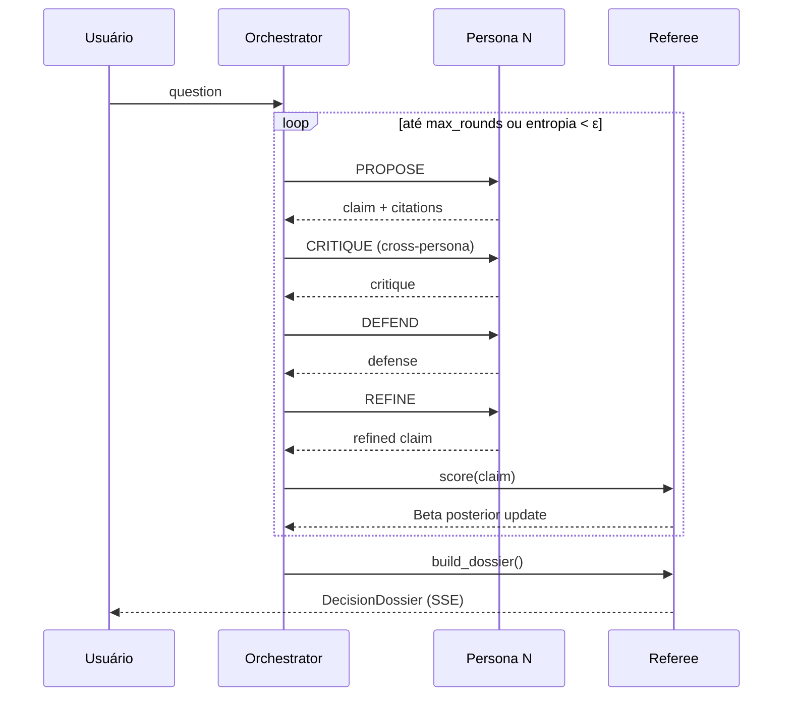

# AURA — Arquitetura

## Visão geral

## Componentes

| Camada              | Implementação                                                    |
|---------------------|------------------------------------------------------------------|
| API                 | FastAPI + sse-starlette                                          |
| Orchestrator        | `aura.orchestrator.Orchestrator` (PCDR-Loop, early-stop entropia)|
| Personas            | `aura.personas.default_council()` (5 agentes)                    |
| Referee             | `aura.referee.Referee` (Beta-Binomial, prior de Jeffreys)        |
| Knowledge           | `aura.knowledge.FoundryIQClient` (Azure AI Search backend)       |
| LLM                 | `aura.llm.AzureOpenAIClient` (Managed Identity)                  |
| Segurança           | `aura.safety.injection` + `aura.safety.redact` (Presidio)        |
| Observability       | structlog + OTel + App Insights                                  |
| Deploy              | Container Apps + Bicep (`azd up`)                                |

## PCDR-Loop

## Segurança — defense in depth

1. **Injection guard #1** no boundary HTTP (`POST /debates`).
2. **Injection guard #2** após cada fetch de Knowledge (instrução vinda de doc envenenado).
3. **PII redactor** (Presidio) em outputs antes da emissão SSE.
4. **Suite Red-Team** (43 prompts) executada no CI — falha o build se block-rate < 90%.
